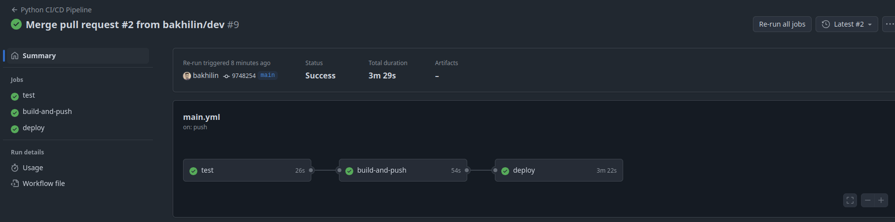
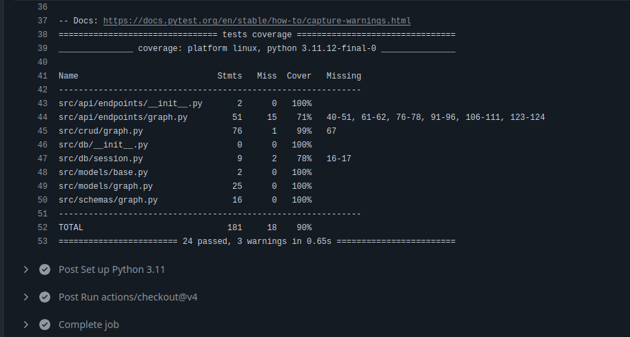

# DAG Service. API References Manual

Сервис на FastAPI для хранения и отображения направленных ациклических графов (DAG) (далее - сервис) с хранением данных в PostgreSQL.


#### За более подробной документацией предлагаю обратиться к интернет ресурсу https://nikitos.tech/dag/docs

## Общие принципы
Есть сервис написанный на FastAPI, которые принимает HTTP запросы на endpoints указанные в документации. Операции с методом POST записываются в БД PostgreSQL. Приложение развернуто на prod среде на удаленном сервере. Настроен CI конвеер для доставки изменений. 

### Как запустить? 

Есть два варианта.

#### First way

```bash
    wget https://nikitos.tech/dag/scripts/test.sh && \
    chmod +x test.sh && \
    sudo ./test.sh
```

#### Second way

```bash
    git clone https://github.com/bakhilin/dag-service.git
```
```bash
    cd dag-service && docker compose up -d --build
```

Более подробно можно ознакомиться здесь https://nikitos.tech/dag/docs/quickstart.html

#### Как тестировать ? 

В Dockerfile есть инструкция которая прогоняет тесты и выводит тестовое покрытие, но можно ит локально, но нужно установить poetry.

```bash
    poetry install
```

```bash
    poetry run pytest --cov=app --cov-report=term-missing
```

### CI пайплайн



### Coverage (Тестирование показывает наличие багов, а не их отсутствие! ISTQB)



Существуют разные методы тестирования. В нашем случае мы проводим UNIT тестирование используя разные уровни доступа к программному модулю.


#### Тестирование методом черного ящика (Black Box)
`test_create_graph_success` - Проверяет, что граф создается с корректными узлами и ребрами

`test_get_full_graph` - Проверяет корректность возвращаемой структуры данных

`test_get_full_graph_not_found` - Тестирует обработку ошибки для несуществующего графа

`test_get_graph / test_get_graph_not_found` - Проверяют контракт метода (возврат GraphModel или None)

`test_get_adjacency_list / test_get_reverse_adjacency_list` - Проверяют соответствие ожидаемому формату ответа

`test_delete_node_success / test_delete_node_not_found` -  Тестируют публичное поведение метода (успех/неудача)

#### Тестирование методом белого ящика (White Box)
`test_is_dag_acyclic / test_is_dag_cyclic` - Проверяют алгоритм определения циклов в графе.     
